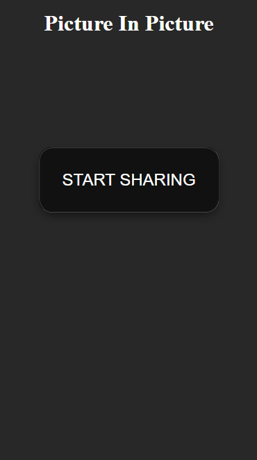
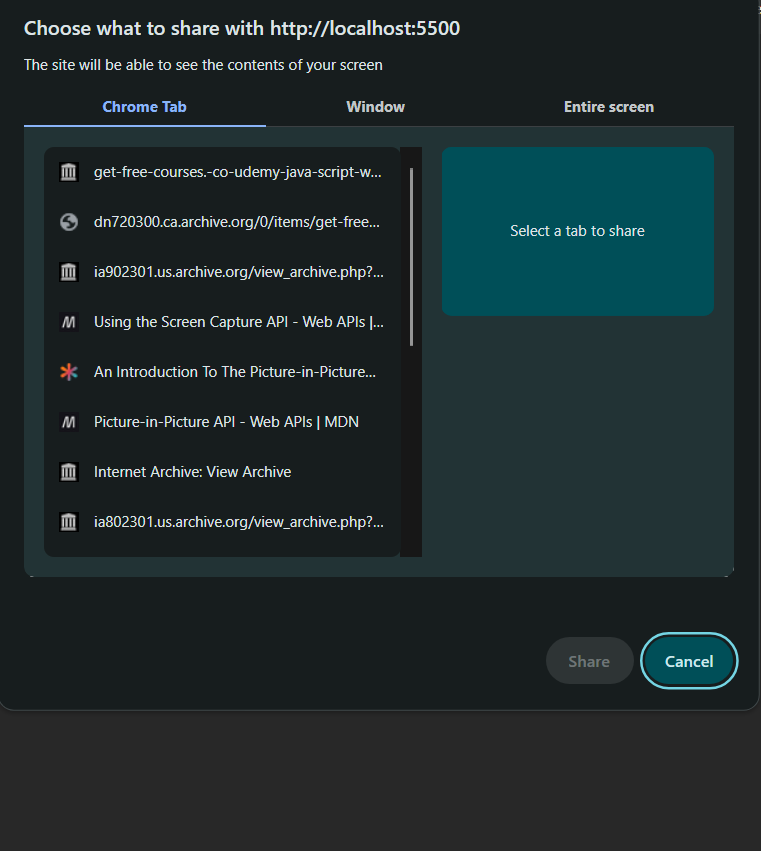
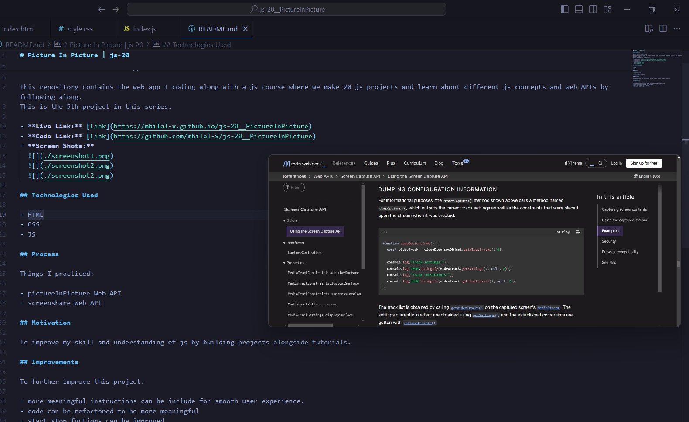

# Picture In Picture | js-20

## Introduction

Welcome to PictureInPicture App

This repository contains the web app I coding along with a js course where we make 20 js projects and learn about different js concepts and web APIs by following along.
This is the 5th project in this series.

- **Live Link:** [Link](https://mbilal-x.github.io/js-20__PictureInPicture)
- **Code Link:** [Link](https://github.com/mbilal-x/js-20__PictureInPicture)
- **Screen Shots:**
  
  
  

## Technologies Used

- HTML
- CSS
- JS

## Process

Things I practiced:

- pictureInPicture Web API
- screenshare Web API

## Motivation

To improve my skill and understanding of js by building projects alongside tutorials.

## Improvements

To further improve this project:

- more meaningful instructions can be include for smooth user experience.
- code can be refactored to be more meaningful
- start stop fuctions can be improved
- design can be improved
